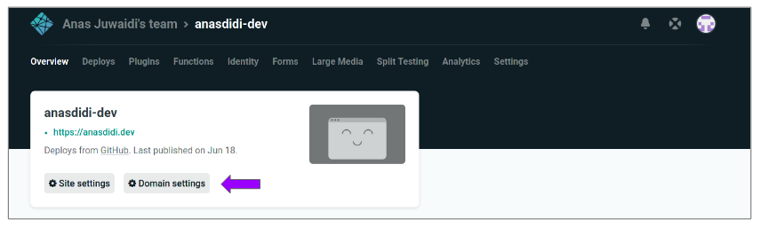
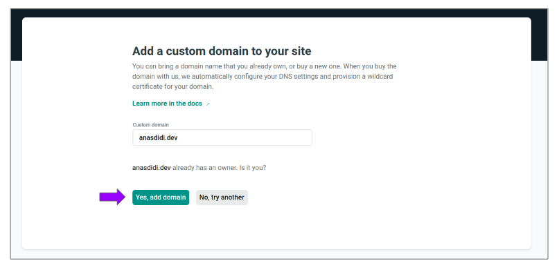
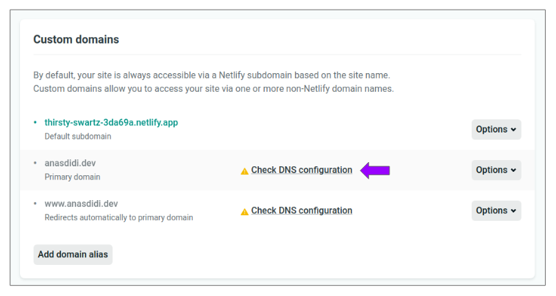
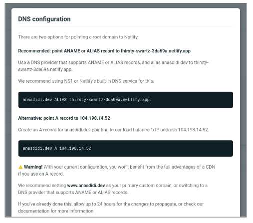
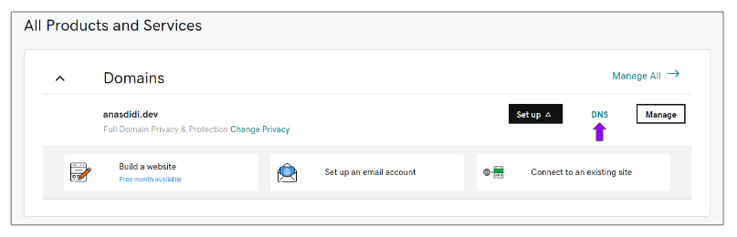
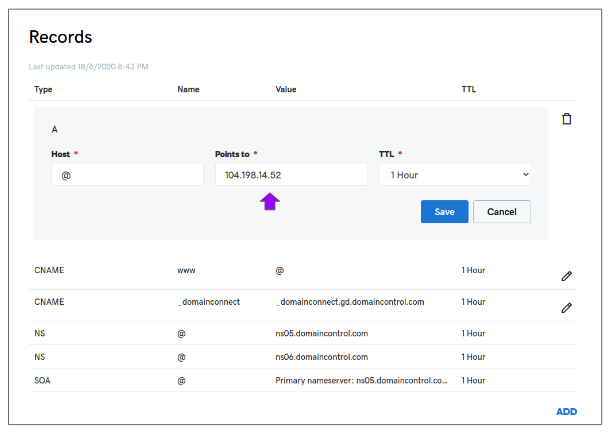
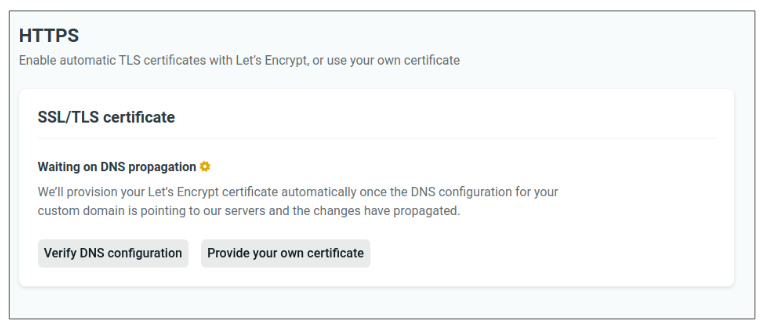
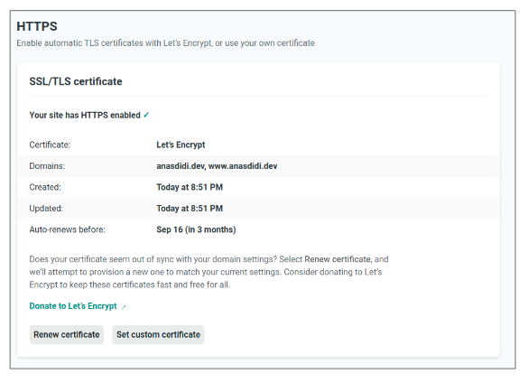

By default, any site deployed to Netlify will be provided with Netlify subdomain using the following template: `[site-name].netlify.app`

However, if we already have an external registered domain from other provider such as GoDaddy, we can configure the DNS provider to point to your domain to Netlify.

Following entries will guide on how to configure DNS from GoDaddy to point to Netlify.

---

## Table of contents
* [Domain settings in Netlify](#domain-settings-netlify)
* [DNS configuration](#dns-configuration)
* [Verify DNS configuration](#verify-dns-configuration)
* [References](#references)

---

## Domain settings in Netlify
Login to Netlify Dashboard, open your project and click **Domain settings**.

Add click **Add domain alias** under **Custom domains** box.

Next, enter the domain registered with GoDaddy and click **Yes, add domain** to confirm the domain verification.

---

## DNS configuration

After added, Netlify will try to propagate the DNS changes with GoDaddy. Then, click **Check DNS configuration** for details required for GoDaddy configuration.

We got two options: either we can **point ANAME/ALIAS/CNAME record to Netlify subdomain** or we can **create an A record pointing to Netlify load balancer**.

This guide will choose 2nd option as we are going to configure the root domain *(Apex domain)* from GoDaddy to our site.

Login to GoDaddy Dashboard and click **DNS** under our registered domain to setup the DNS.

Next, update the A record to points to Netlify load balancer from previous DNS configuration details and save.

---

## Verify DNS configuration
Back to Netlify domain settings panel, refresh the page and it will say it is waiting for the DNS to propagate under **HTTPS**.

Once it is complete, Netlify will automatically provision the SSL certificate using Let's Encrypt. Wait a few minutes for the certificate to be provisioned.

Now, we can get access to our Netlify-deployed site using our registered custom domain with HTTPS enabled!

---

## References

* [Custom Domains in Netlify; serverless-stack.com](https://serverless-stack.com/chapters/custom-domain-in-netlify.html)
* [Configure external DNS for a custom domain; netlify.com](https://docs.netlify.com/domains-https/custom-domains/configure-external-dns/#configure-a-subdomain)

