Regular expression or shortened as **regex** is a sequence of characters to define a search pattern.

Regex allows us to search for specific, standard textual syntax for representing patterns for matching text. 

Though look complicated, regex are very powerful as it can be used to create and match any text pattern.

Usually, operations such as string searching algorithms and input validation solved by using regex. 

Thus, regex is used in search engines and in search and replace dialog of text editors.

---

## Table of contents
* [Metacharacter](#metacharacter)
  * [^ *(Caret)*](#caret)
  * [. *(Dot)*](#dot)
  * [\[ \]](#square-bracket)
  * [\[^ \]](#caret-bracket)
  * [$ *(Dollar)*](#dollar)
  * [* *(Asterisk)*](#asterisk)
  * [+ *(Plus)*](#plus)
  * [? *(Question mark)*](#question-mark)
  * [{n}](#curly-n)
  * [{n,m}](#curly-m-n)
  * [| *(Pipe)*](#pipe)
* [Example usage](#example-usage)
  * [Email validation](#email-validation)
  * [Phone validation](#phone-validation)
* [References](#references)

---

## Metacharacter

Metacharacter is a character that has a special meaning to a regex.

Following are the common metacharacters in regex and description:

---

### ^ *(Caret)*

Matches the starting position within the string.

**Example**
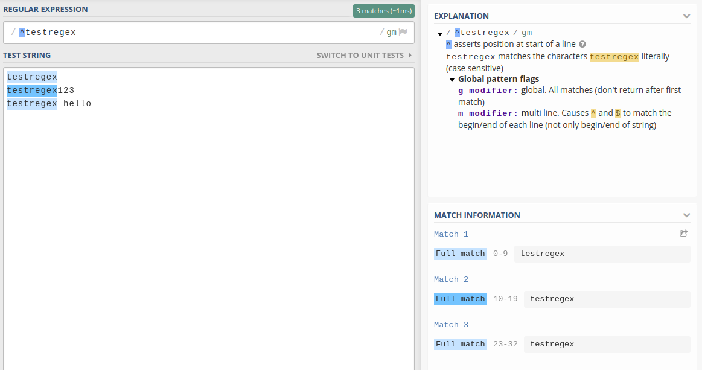

---

### . *(Dot)*

Matches any single character. Can be used as *wildcard* character.

**Example**
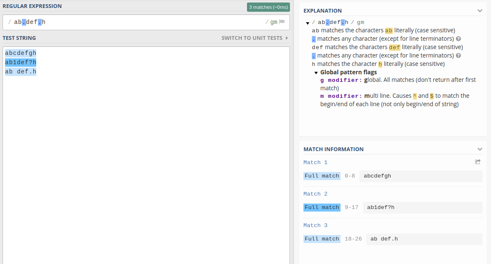

---

### [ ]

Matches a single character that is contained within the bracket.

**Example**
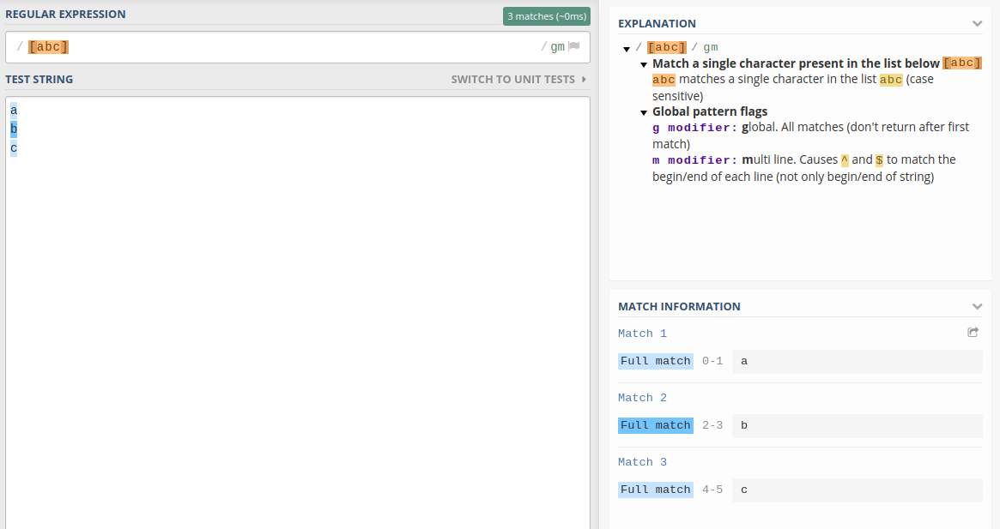

`-` can be used to specific a range of characters. Thus, `[a-z]` matches "a" until "z".

**Example**
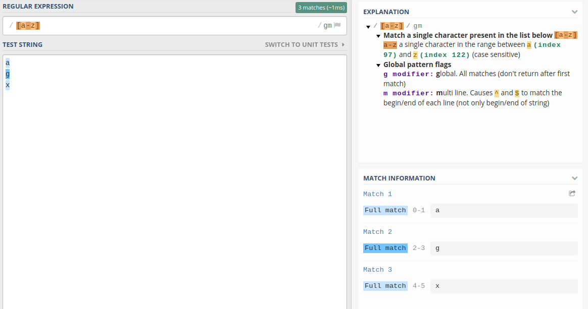

---

### [\^ ]

Matches a single character that is not contained within the bracket.

**Example**
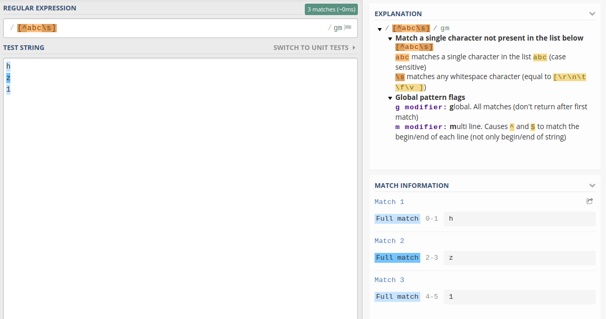

`-` can be used to specific a range of characters. Thus, `[^a-z]` matches any except "a" until "z".

**Example**
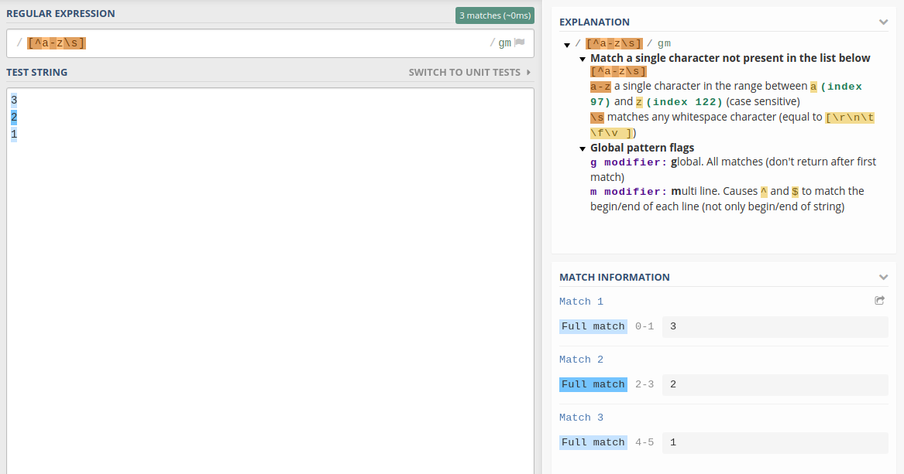

---

### $ *(Dollar)*

Matches the ending position of the string.

**Example**
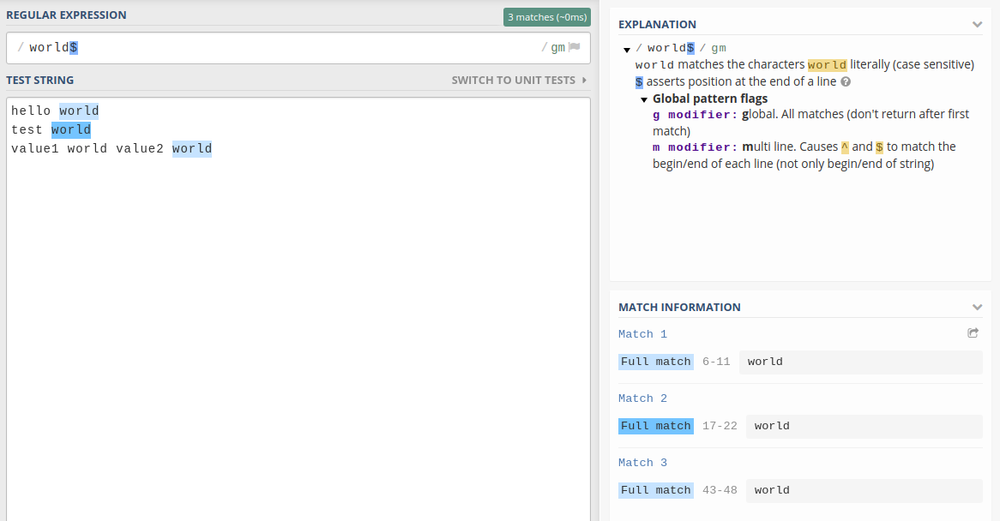

---

### * *(Asterisk)*

A repeater where matches when the character preceding `*` matches 0 or more times.

**Example**
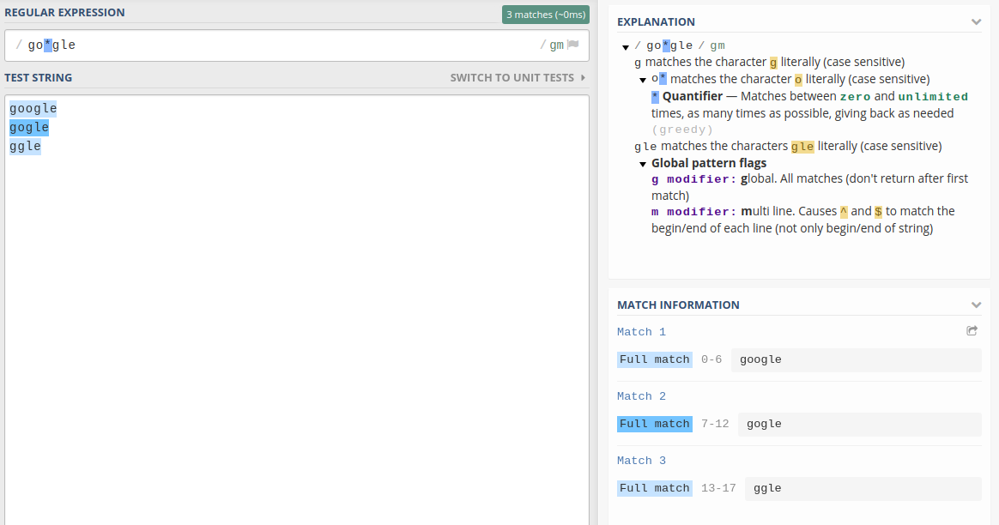

---

### + *(Plus)*

A repeater where matches when the character preceding `+` matches at least one or more times.

**Example**
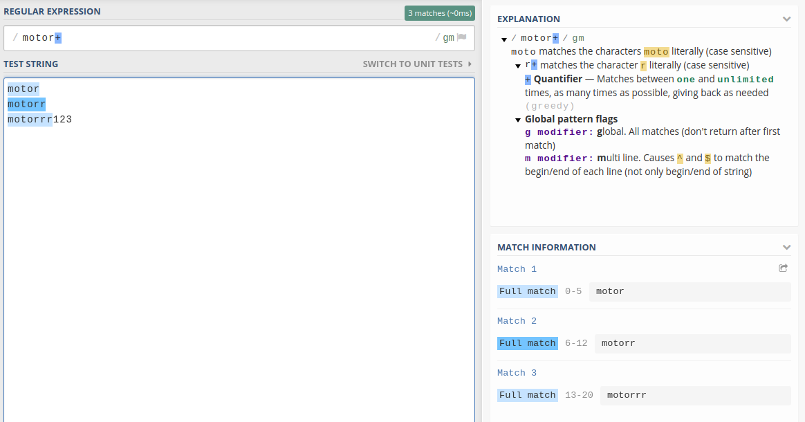

---

### ? *(Question mark)*

Matches when the character preceding `?` occurs 0 or 1 time only, making the character optional.

**Example**
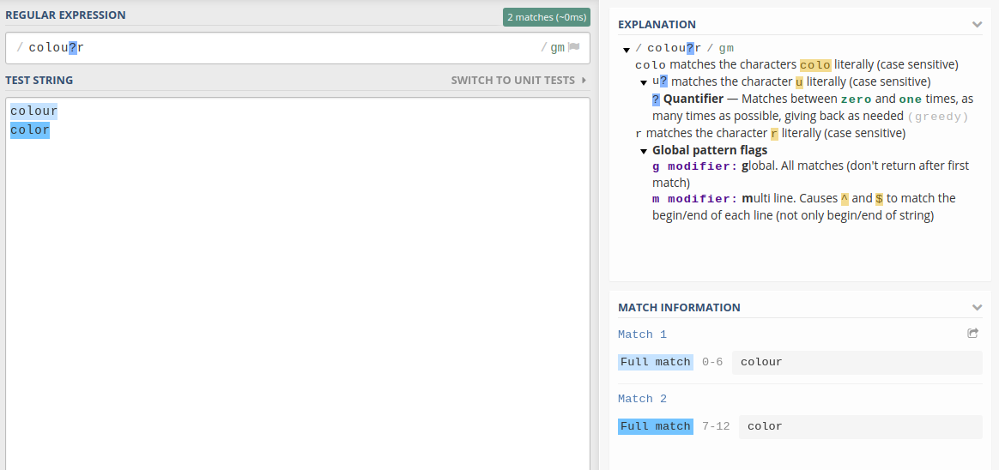

---

### {n}

Matches when the preceding character occurs *n* times.

**Example**
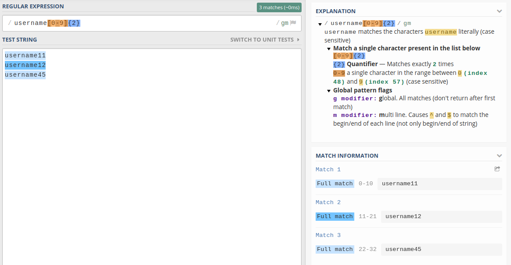

---

### {m,n}

Matches when the preceding character occurs at least *m* and not more than *n* times.

**Example**
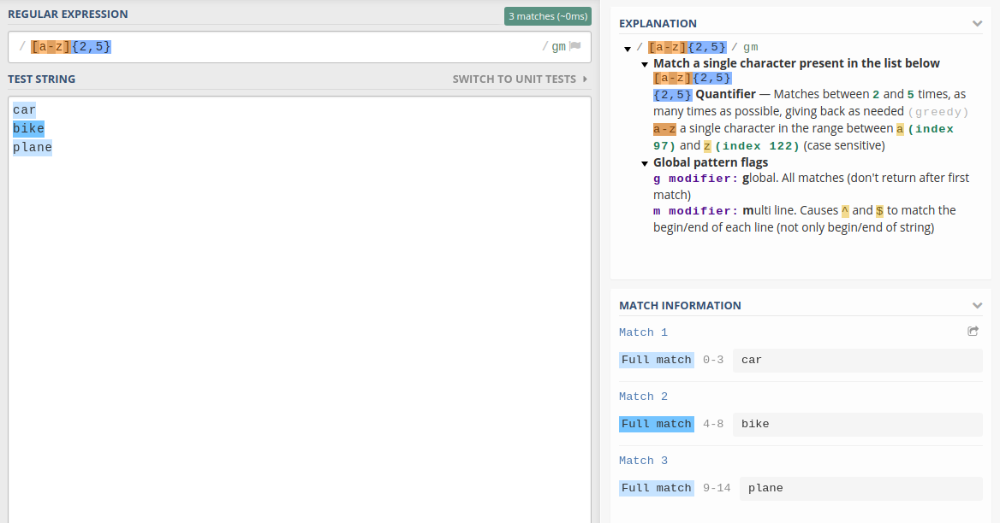

---

### | *(Pipe)*

Matches either the expression before or expression after the `|`.

**Example**
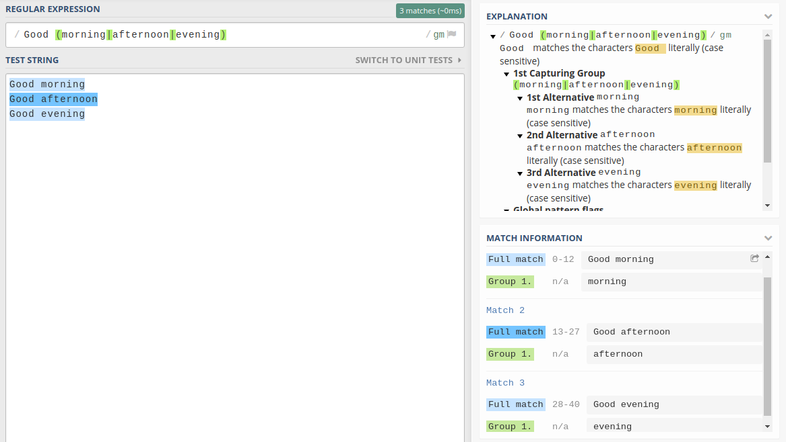

---

## Example usage

Following are common usages of regex. 

If the usage required to use metacharacter as literal character, we can used backslash `\` to escape the character.

---

### Email validation

`^[a-z0-9_\.]+@[a-z]+\.[a-z]{2,3}$`

**Result**
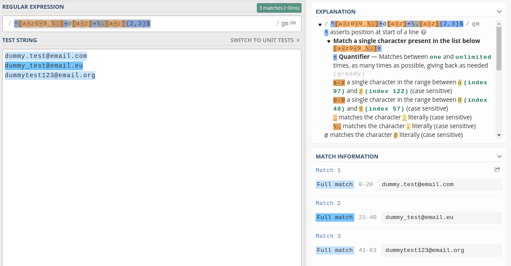

---

### Phone validation

Regex is used to match phone validation used in Malaysia.

`^\+6[0-9]{2,3}-[0-9]{7,8}$`

**Result**
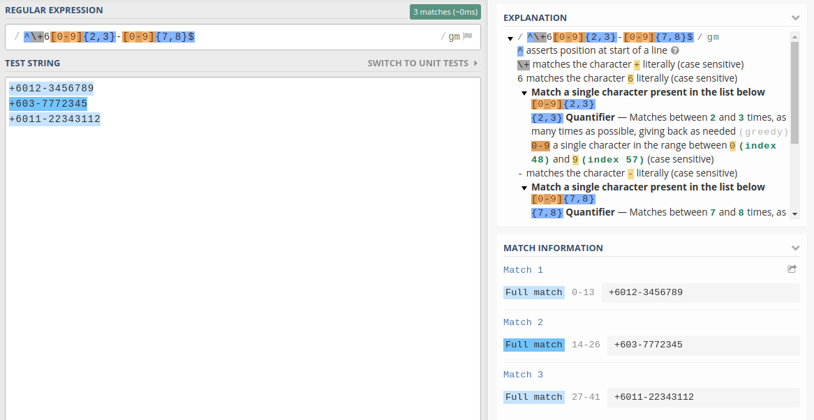

---

## References

* [Regular Expression; wikipedia.org](https://en.wikipedia.org/wiki/Regular_expression)
* [A Programmer's Guide to Regex or Regular Expressions; hackernoon.com](https://hackernoon.com/a-programmers-guide-to-regex-or-regular-expressions-0daw30be)
* [Online regex tester and debugger; regex101.com](https://regex101.com/)

