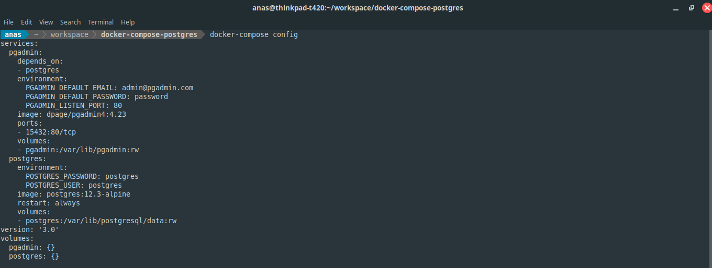
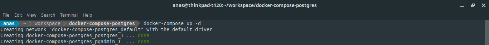
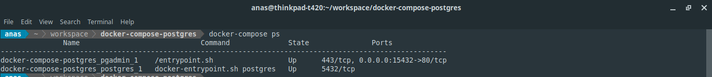
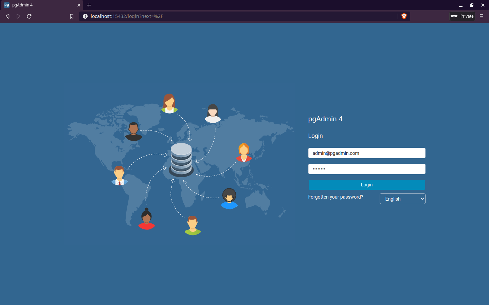
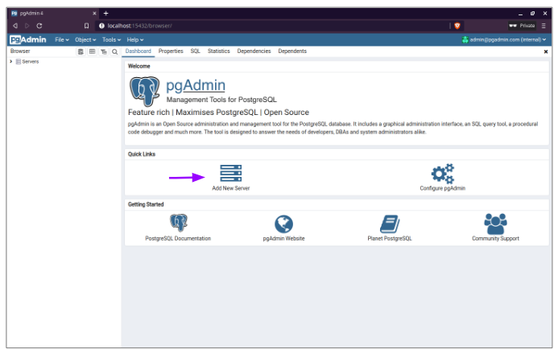
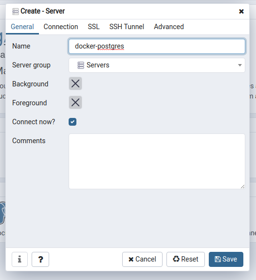
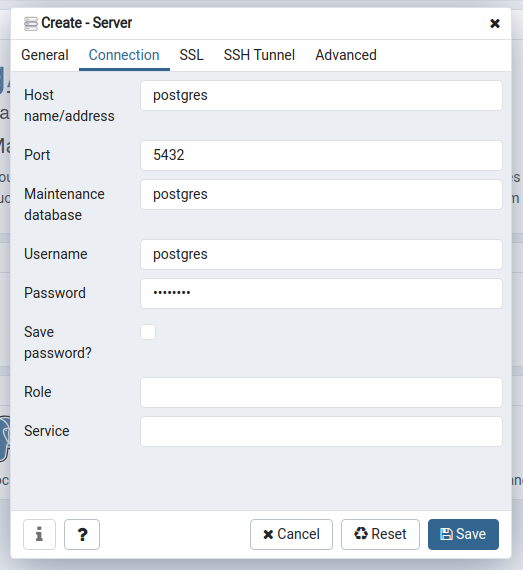
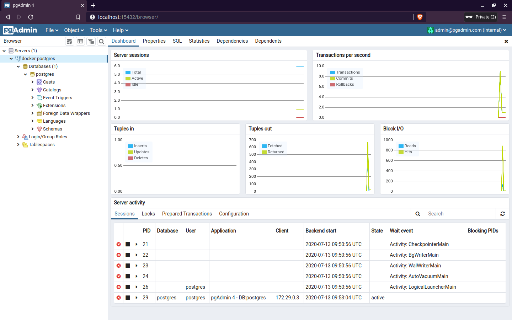
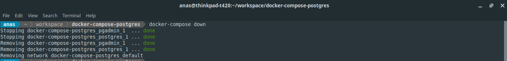

**Docker** is a set of tools that utilises OS-level virtualization to running software in packages called container.

While Docker is mainly used in deployment, it can also be use in development environment. By running a container for development environment,
we can avoid to install a bunch of tools or languages on our machine.

For example, we can use Docker to run service such as **postgres** and **pgadmin** for database service and administration platform for PostgreSQL respectively in a container.

To demonstrate, we will configure Postgres and pgAdmin with **Docker Compose** for database service for our development environment.

---

## Table of contents
* [Tools](#tools)
* [Create a Docker Compose file](#docker-compose-file)
  * [postgres](#postgres)
  * [pgadmin](#pgadmin)
  * [Example](#example)
* [Running Docker Compose](#running-docker-compose)
* [Open pgAdmin](#open-pgadmin)
  * [Setup database](#setup-database)
* [Stopping Docker Compose](#stopping-docker-compose)
* [References](#references)

---

<a name="tools"></a>
## Tools

First, we need to install the tools required.

1. [Docker](https://docs.docker.com/get-docker/)
2. [Docker Compose](https://docs.docker.com/compose/install/)

Both can be installed by referring to the official guide on how to install based on our machine platform.

---

<a name="docker-compose-file"></a>
## Create a Docker Compose file

**Docker Compose** is a tool for defining and running multi-container Docker applications. By using Docker Compose, we can orchestrate on how the applications/services start in the container by a single command.

Moreover, Docker Compose allows us to:
* Start, stop, and rebuild services
* View the status of running services
* Stream the log output of running services
* Run a one-off command on a service

Next, we are going to create a Docker Compose file `docker-compose.yml` to define the services that we are going to run in the container.

The services are:
1. **postgres**: PostgreSQL database service
2. **pgadmin**: Administration and development platform for PostgreSQL

---

<a name="postgres"></a>
### postgres

Below is the snippet for the service:
```yaml
postgres:
    image: postgres:12.3-alpine
    restart: always
    environment:
        POSTGRES_PASSWORD: postgres
        POSTGRES_USER: postgres
    volumes:
        - postgres:/var/lib/postgresql/data
```

**Explanation**
* `image`: Specify the image to start the container from. In this case, we are going to use **postgres:12.3-alpine** from [Docker Hub](https://hub.docker.com/_/postgres/).
* `restart`: Configure container to always restart if container stopped unexpectedly.
* `environment`: Configure environment variable for database superuser authentication.
* `volumes`: Mount named volumes for database files.

---

<a name="pgadmin"></a>
### pgadmin

Below is the snippet for the service:
```yaml
pgadmin:
    image: dpage/pgadmin4:4.23
    environment:
        PGADMIN_DEFAULT_EMAIL: admin@pgadmin.com
        PGADMIN_DEFAULT_PASSWORD: password
        PGADMIN_LISTEN_PORT: 80
    ports:
        - 15432:80
    volumes:
        - pgadmin:/var/lib/pgadmin
    depends_on:
        - postgres
```

**Explanation**
* `image`: Specify the image to start the container from. In this case, we are going to use **dpage/pgadmin4:4.23** from [Docker Hub](https://hub.docker.com/r/pgadmin/ripmain).
* `environment`: Configure environment variable for application authentication and setup.
* `ports`: Map port between host machine **15432** and container **80**.
* `volumes`: Mount named volumes for application files.
* `depends_on`: Define the dependencies of services. This allow us to deploy service in order; e.g. `postgres` -> `pgadmin`.

---

<a name="example"></a>
### Example

Then, we will going to put all services' configuration in file `docker-compose.yml`. Because we are using the **named volume**, we also need to configure the volumes based on the name we used in services.

**Snippet**
```yaml
version: "3"

services:
    postgres:
        image: postgres:12.3-alpine
        restart: always
        environment:
            POSTGRES_PASSWORD: postgres
            POSTGRES_USER: postgres
        volumes:
            - postgres:/var/lib/postgresql/data

    pgadmin:
        image: dpage/pgadmin4:4.23
        environment:
            PGADMIN_DEFAULT_EMAIL: admin@pgadmin.com
            PGADMIN_DEFAULT_PASSWORD: password
            PGADMIN_LISTEN_PORT: 80
        ports:
            - 15432:80
        volumes:
            - pgadmin:/var/lib/pgadmin
        depends_on:
            - postgres

volumes:
    postgres:
    pgadmin:
```

---

<a name="running-docker-compose"></a>
## Running Docker Compose

First, we are going to **check and validate** the Compose file by execute command: `docker-compose config`.


*Figure 01: Example `docker-compose config` output*

Next, we are **deploying and running** the service by execute command: `docker-compose up -d`.


*Figure 02: Example `docker-compose up -d` output*

The output may vary depends on if we already downloaded the images and setup the volumes.

To check if services are running successfully, we can use command: `docker-compose ps`.


*Figure 03: Example `docker-compose ps` output*

---

<a name="open-pgadmin"></a>
## Open pgAdmin

After running Docker Compose services, open web browser and go to `localhost:15432`. The port number is based on the mapping we configured under **pgadmin** service.

Then key-in the email and password configured using the environment variable: `PGADMIN_DEFAULT_EMAIL` and `PGADMIN_DEFAULT_PASSWORD`.


*Figure 04: pgAdmin login page*

---

<a name="setup-database"></a>
### Setup database

Click **Add New Server** under **Quick Links**.


*Figure 05: Add new server*

Enter **Name** under **General**. The value can be anything.


*Figure 06: Server name*

Enter **Host name/address**, **Username** and **Password** under **Connection**.
* For **Host name/address**, the value is the Docker Compose database service name, in our case is **postgres**.
* For **Username**, the value is the environment variable `POSTGRES_USER`.
* For **Password**, the value is the environment variable `POSTGRES_PASSWORD`.


*Figure 07: Server connection*

And click **Save** to finish create. After done, we can get access to the database from the sidebar.


*Figure 08: Database dashboard*

---

<a name="stopping-docker-compose"></a>
## Stopping Docker Compose

To stop Docker Compose service, just execute command: `docker-compose down`


*Figure 09: Example `docker-compose down` output*

---

<a name="references"></a>
## References

* [Docker (software); wikipedia.org](https://en.wikipedia.org/wiki/Docker_%28software%29)
* [Why and How To Use Docker for Development; medium.com](https://medium.com/better-programming/why-and-how-to-use-docker-for-development-a156c1de3b24)
* [Compose file version 3 reference; docker.com](https://docs.docker.com/compose/compose-file/)


