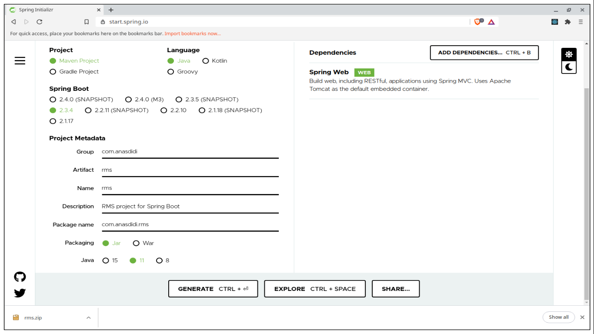
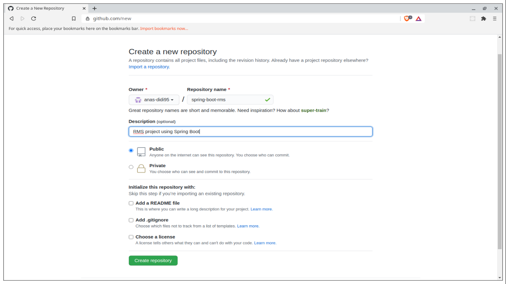
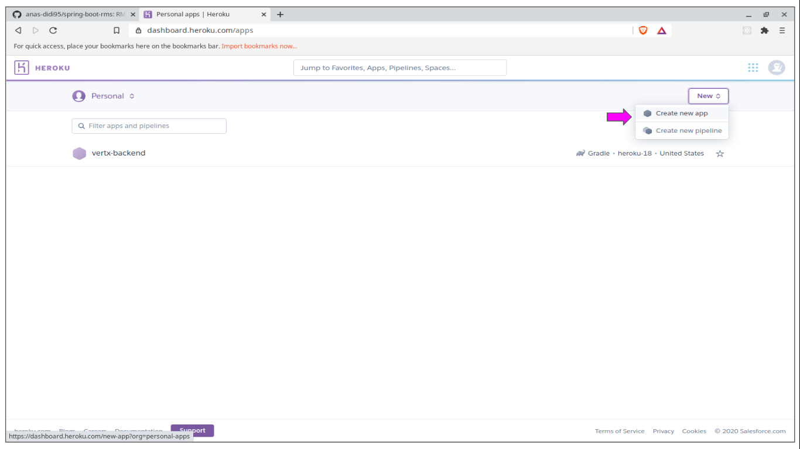
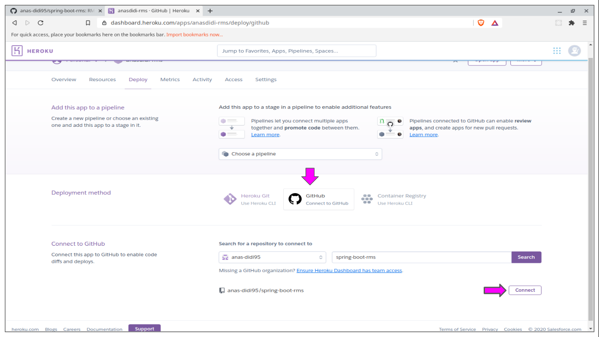
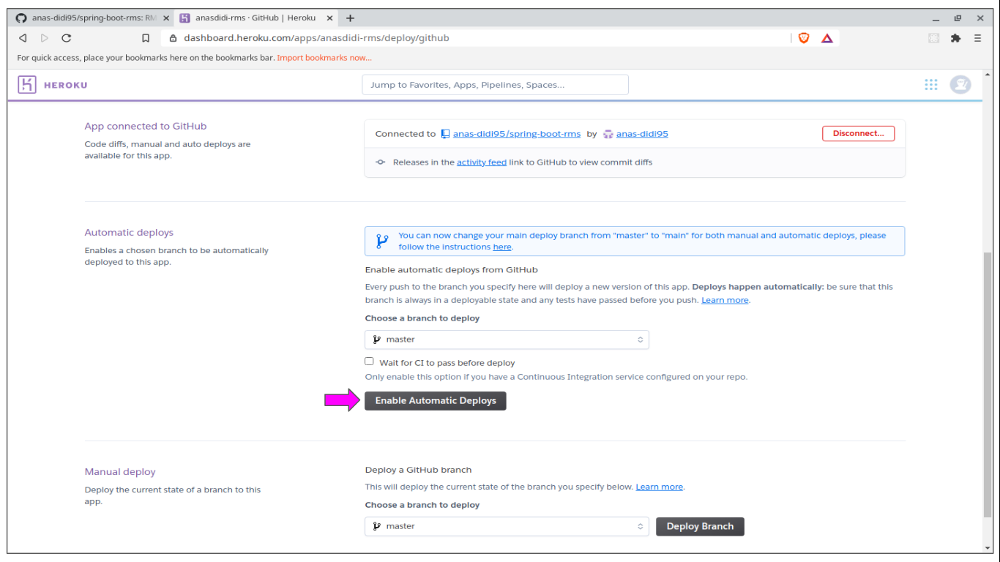
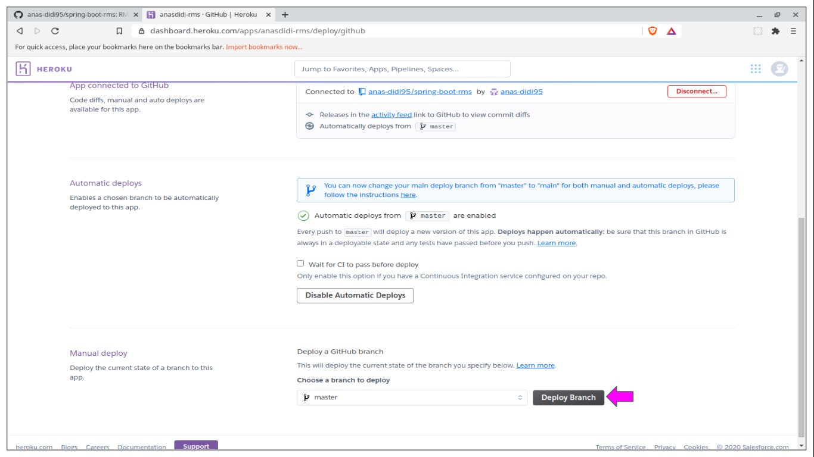
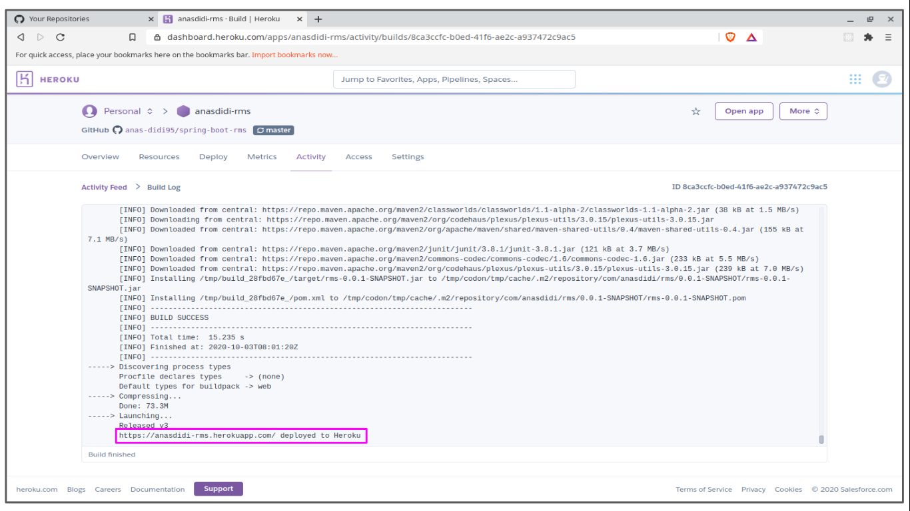

**Spring Boot** packaging model enables us to package the application into a standalone application. Combine with **Heroku** to deploy the application, it will make deployment more easier compared to setup our own server.

Heroku is a cloud platform that lets companies build, deliver, monitor and scale apps. Heroku makes the processes of deploying, configuring, scaling, tuning, and managing apps as simple and straightforward as possible, so that developers can focus on what’s most important: building great apps that delight and engage customers.

Therefore, using Heroku not only make it easier for deployment, it also provides tool for us to maintain and monitor the application.

Following is the guide on how to deploy Spring Boot application with Heroku using Github as deployment method.

---

## Table of contents
* [Generate project](#generate-project)
* [Create web controller](#create-web-controller)
* [Push to Github](#push-to-github)
* [Deploy to Heroku](#deploy-to-heroku)
* [Conclusion](#conclusion)
* [References](#references)

---

<a name="generate-project"></a>
## Generate project

First, we need to generate Spring Boot project. And the easier way to do this is by using [Spring Initializr](https://start.spring.io/) website. **Spring Initializr** is a web-based tool provided by Pivotal Web Service to help generating Spring Boot project within clicks.


*Figure 01: Spring Initializr website*

In the website, we can setup the project components such as package management, language, metadata and dependency. Thus, the website offers a fast way to pull in all the dependencies we need for an application and does a lot of the setup for us.

This sample project will add **Spring Web** for the dependency.

---

<a name="create-web-controller"></a>
## Create web controller

Next, we are going to create sample controller for the application. This controller allows us to send HTTP requests into the application and get the result back.

In Spring Boot, we annotate the class with `@Controller` or `@RestController` to identify it as controller. 
* `@Controller` is used to mark class as Spring MVC controller which allows us to return a view (e.g. HTML) as response. 
* `@RestController` is convenience annotation for both `@Controller` and `@ResponseBody` which allows us to convert response to JSON/XML automatically.

In the sample, **HelloController** handles **GET** request for **/hello** which will return a String as response.

```java
package com.anasdidi.rms.controller;

import org.springframework.http.ResponseEntity;
import org.springframework.web.bind.annotation.RequestMapping;
import org.springframework.web.bind.annotation.RequestMethod;
import org.springframework.web.bind.annotation.RestController;

@RestController
public class HelloController {

  @RequestMapping(value = "/hello", method = RequestMethod.GET)
  public ResponseEntity<String> getGreeting() {
    return ResponseEntity.ok().body("Hello World");
  }
}
```

Then, we can test the controller in local environment by using **cURL** to send request to **localhost:8080/hello**.

```bash
$ curl --request GET --url http://localhost:8080/hello
Hello World
```

Currently, this application is using Java 11 and Heroku is using Java 8 to run application by default. Therefore, we need to specify a Java version for the application by set a property `java.runtime.version` in the file `system.properties`.

```properties
# system.properties
java.runtime.version=11
```

Now the sample application is ready to be push to Github and deploy into Heroku.

---

<a name="push-to-github"></a>
## Push to Github

We are going to create new repository on Github for the application.


*Figure 02: Create new repository*

Then, we are going to push and existing repository using the command line.
```
$ git remote add origin git@github.com:anas-didi95/spring-boot-rms.git
$ git push -u origin master

Enumerating objects: 75, done.
Counting objects: 100% (75/75), done.
Delta compression using up to 4 threads
Compressing objects: 100% (50/50), done.
Writing objects: 100% (75/75), 57.40 KiB | 6.38 MiB/s, done.
Total 75 (delta 11), reused 0 (delta 0)
remote: Resolving deltas: 100% (11/11), done.
To github.com:anas-didi95/spring-boot-rms.git
 * [new branch]      master -> master
Branch 'master' set up to track remote branch 'master' from 'origin' by rebasing.
```

Refresh the page to see the project is pushed into Github.

---

<a name="deploy-to-heroku"></a>
## Deploy to Heroku

Login to Heroku dashboard and create new app and fill in the required details.


*Figure 03: Create new app*

Choose **Github** as deployment method for the app, enter the repository name and click **Search**. From the result, click **Connect** to choose the repository.


*Figure 04: Github deployment method*

Next, we will enable **Automatic deploys** for the app. Any changes on the branch selected in Github will deploy a new version of this app. We are going to choose **master** branch to watch and click **Enable Automatic Deploys** to confirm.


*Figure 05: Automatic deploys*

Finally, click **Deploy Branch** to start deploy the application into Heroku.


*Figure 06: Deploy branch*

We can get the build log from **Activity** tab and click **View build log**. In the log, we will get the URL to get access to the app.


*Figure 07: Build log*

Trying to access the URL given will get the similar result during development.

```bash
$ curl --request GET --url https://anasdidi-rms.herokuapp.com/hello
Hello World
```

---

<a name="conclusion"></a>
## Conclusion

In conclusion, deploy Spring boot application with Heroku is more easier compared to setup our own server. 

This tool allows developers to focus more on apps and getting the apps out onto the Internet quickly and iterating. Thus, Heroku is an amazing developer experience. Heroku gets out of the way where it matters, letting devs get on with what they do best - developing apps.

---

<a name="references"></a>
## References

* [What is Heroku; heroku.com](https://www.heroku.com/what)
* [Spring Initializr; spring.io](https://start.spring.io/)
* [Heroku Java Support; heroku.com](https://devcenter.heroku.com/articles/java-support)

